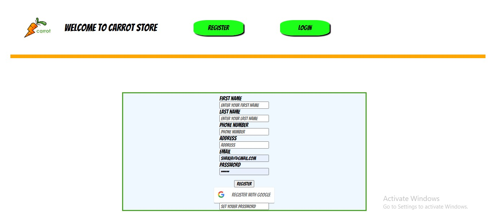

<p align="center">
  <a href="" rel="noopener">
 </a>
</p>

<h3 align="center">Carrot Store</h3>

---

<p align="center"> The Best Place To Get your Grocery From.
    <br> 
</p>

## 📝 Table of Contents

- [About](#about)
- [Getting Started](#getting_started)
- [Usage](#usage)
- [Built Using](#built_using)
- [Guided By](#guided_by)

## 🧐 About <a name = "about"></a>

An online grocer is either a brick-and-mortar supermarket or grocery store that allows online ordering, or a standalone e-commerce service that includes grocery items

According to the last pandemic of covid-19, the need for online stores have been increased even for a simple grocery shopping, our website provides you the service of ordering your needs while relaxing at home with fast deliver

## 🏁 Getting Started <a name = "getting_started"></a>

These instructions will get you a copy of the project up and running on your local machine for development and testing purposes.

### Prerequisites

- VS code <a href="https://code.visualstudio.com/download">download from here</a>

- Git Bash <a href="https://git-scm.com/">download from here</a>

- Mongo DB <a href="https://www.mongodb.com/try/download/community">download from here</a>

- Node.js <a href="https://nodejs.org/en/download/">download from here</a>

### Installing

A step by step series of examples that tell you how to get a development env running.

- Cloning the repo
- in order to clone the repo open the command line and type

```
git clone https://github.com/C5-shakirabugarbia/MERAKI_Academy_Project_4#getting_started
```

- install the packeges
- in order to install the packeges open the command line and type

```
npm i
```

-Running the server
in order to run the server use git bash in side the backend folder and type

```
npm run dev
```

-Running the App
in order to run the App use git bash in side the frontend folder and type

```
npm start
```

 

## 🎈 Usage <a name="usage"></a>

Add notes about how to use the system.

## ⛏️ Built Using <a name = "built_using"></a>

- [MongoDB](https://www.mongodb.com/) - Database
- [Express JS](https://expressjs.com/) - Server Framework
- [React JS](https://https://reactjs.org/) - Web Framework
- [Node JS](https://nodejs.org/en/) - Server Environment

## ⚠️ Guided By <a name = "guided_by"></a>

This project is guided by ©️ **[MERAKI Academy](https://www.meraki-academy.org)**
